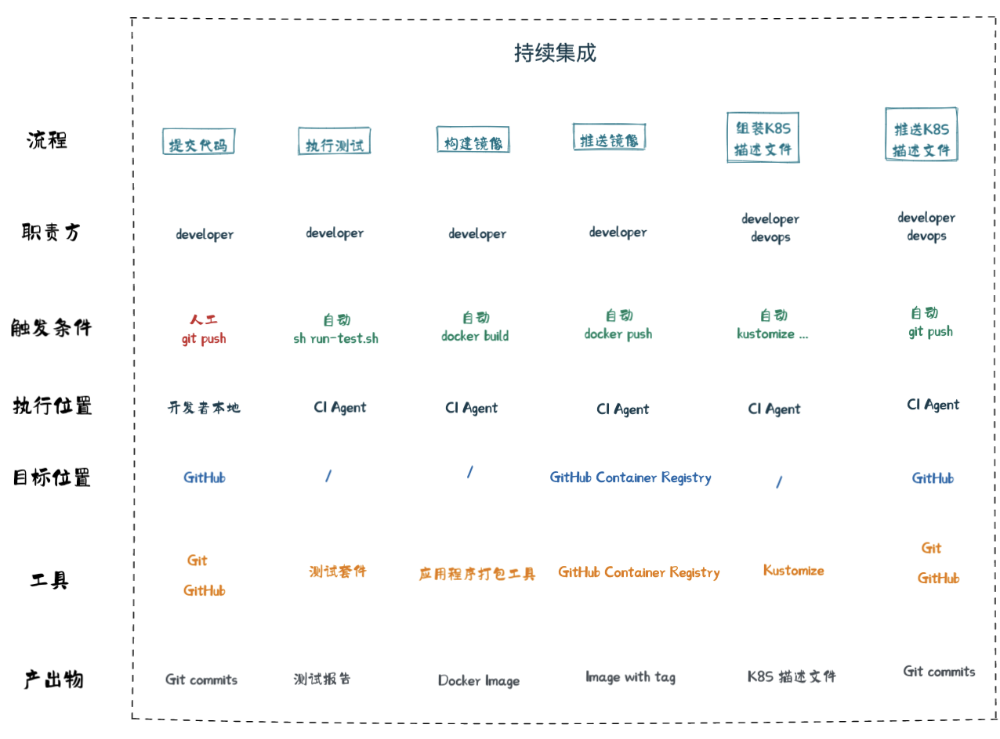

Step 6. GitOps 持续部署
--
## 6-1 使用 Git 管理 K8S配置文件和 Image 版本

- [ ] 使用 GitHub Actions 创建 Workflow
- [ ] 使用 GitHub container registry 里的 image 部署 local-stable


### 6-1.1 使用 GitHub Actions 创建 Workflow

- 阅读了解 GitHub Actions，[文档](https://docs.github.com/zh/actions/learn-github-actions/understanding-github-actions)
- 按照已完成的流水线设计构建 book-service 的 workflow，见 [.github/workflows/book-service.yaml](../.github/workflows/book-service.yaml)
  
- 参考[文档](https://docs.github.com/zh/packages/working-with-a-github-packages-registry/working-with-the-container-registry#%E5%90%91-container-registry-%E9%AA%8C%E8%AF%81)完成 GITHUB_TOKEN 配置，以能够使用 GitHub Actions
- push 代码并查看 workflow 的运行结果

#### 验收条件

1. GitHub Actions 运行 CI 并通过
2. 查看 push 的 Docker Image
3. 查看自动提交的 K8S 文件

### 6-1.2 使用 GitHub container registry 里的 image 部署 local-stable

- 修改配置使 kind-stable 环境从 GitHub Container Registry 拉取镜像

  ```bash
  # apps/book-service/scripts/kustomize-build.sh
  IMAGE="ghcr.io/{your-account-name}/$SERVICE_NAME:$VERSION"
  export IMAGE_PULL_SECRET="ghcr-login-secret"
  ```
- 创建环境变量，使其可以作为模块 [github-registry](../terraform/module/github-registry) 参数

  ```bash
  export TF_VAR_github_token={your-github-token}
  export TF_VAR_github_user={your-account-name}
  ```
- 参照 step 1-5，并安装模块 github-registry，在 kind-stable 环境部署 book-service
- 在 kind-stable 环境部署其他应用服务

#### 验收条件

curl http://localhost/stable/api/web-app/books 返回正确的 json

curl http://localhost/stable/api/web-app/orders 返回正确的 json
